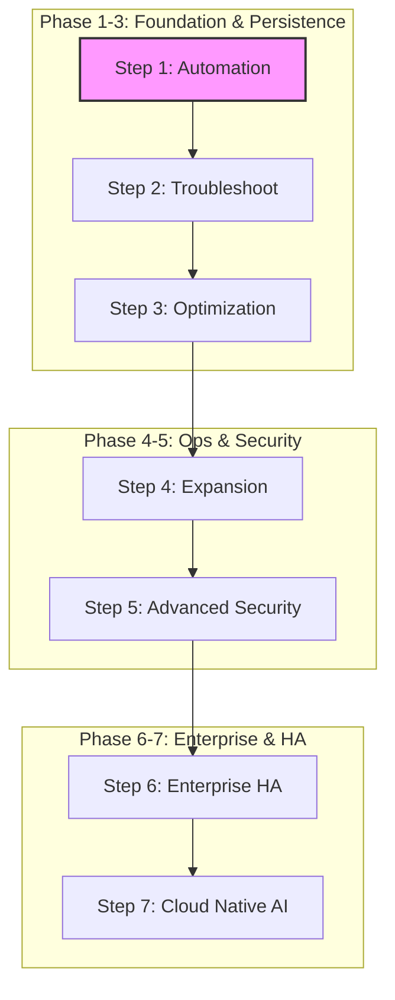

# Cloud Infra Project: 실무 기반 인프라 구축 및 운영

본 프로젝트는 보안성, 가용성, 자동화를 핵심 가치로 하는 실무 수준의 클라우드 인프라 설계 및 운영 가이드

---

## 🚀 학습 로드맵 (Learning Roadmap)

---

## 1. 프로젝트 개요 (Overview)

- **목적:** 안정적이고 보안이 강화된 리눅스 기반 인프라 아키텍처 설계 및 운영 표준 정립
- **핵심 원칙:**
  - **Security:** SSH 키 기반 인증, 사설 레지스트리(Harbor) 운용, 정기 보안 감사 수행
  - **Availability:** RAID/LVM/Ceph 기반 스토리지 설계, 멀티 마스터 DB 클러스터 구축
  - **Automation:** IaC(Ansible/Terraform) 및 GitOps 기반 운영 자동화 구현
  - **Optimization:** APM 및 Stress 테스트 기반의 애플리케이션/시스템 성능 튜닝

## 2. 기술 스택 (Tech Stack)

- **Virtualization:** Proxmox VE (Primary), VMware (Sandbox)
- **OS:** Ubuntu Server 24.04 LTS, Alpine Linux
- **Web/Proxy:** Nginx
- **Container:** Docker (MacVLAN, Bridge, Named Volumes)
- **Registry:** Harbor (Enterprise Private Registry)
- **Storage:** RAID 1/5, ZFS, LVM, Ceph (Distributed)
- **Automation:** Bash Shell, Ansible, Terraform
- **Monitoring/APM:** Prometheus, Grafana, Thanos, Loki, Pinpoint/Scouter

## 3. 문서 시스템 가이드 (Documentation Guide)

- **[README.md](./docs/index.md):** 프로젝트 전체 개요 및 아키텍처 청사진 제공
- **[CORE_FEATURE_EXPLAINER.md](./docs/CORE_FEATURE_EXPLAINER.md):** 프로젝트 핵심 기술적 차별성 및 보안 특장점 상세 설명
- **[project_outline.md](./docs/project_outline.md):** 단계별(Phase 1-6) 기술적 상세 설계 및 체크리스트
- **[Build-up Guide](./docs/build-up/README.md):** 설계 구성안을 실제 환경에 구현하기 위한 단계별 기술 실행 절차
- **[SCENARIOS.md](./docs/SCENARIOS.md):** 상황별 흐름 및 운영 전략(Strategy) 마스터 인덱스
- **[playbooks/](./docs/playbooks/):** 실제 수행 명령어가 담긴 원자적(Atomic) 절차서(Tactics)
  - `ops/`: 일상 운영 및 온보딩 절차
  - `recovery/`: 장애 대응 및 복구 절차
- **[case_studies/](./docs/case_studies/):** 실제 보안 대응 및 트러블슈팅 사례(Lessons Learned) 기록물
- **[knowledge_base/](./docs/knowledge_base/):** 고도화 기술 가이드 및 아키텍처 분석(Thanos, Ceph, AI 등) 자료
- **[Management Docs]:**
  - [Workflow](./docs/PROJECT_WORKFLOW.md): 프로젝트 실행 공정 및 대화 기반 의사결정 로그
  - [Task Guide](./docs/CURRENT_TASK_GUIDE.md): 현재 진행 중인 활성 작업 실행 매뉴얼
  - [Env Setup](./docs/ENVIRONMENT_SETUP.md): 개발 환경 구축 및 품질 관리(pre-commit) 영구 지침
- **[to-do-list.md](./docs/to-do-list.md):** 인프라 구축 및 보안 표준 환경 실습 로드맵
- **[to-do-space/](./docs/to-do-space/):** 로드맵 항목별 단계별 가이드 및 실전 스크립트 보관소
- **[solutions/](./docs/solutions/):** 핵심 오픈소스 솔루션(Airflow, Wazuh, Harbor 등) 구축 가이드

## 4. 인프라 구축 단계 (Infrastructure Phases)

- **Phase 1 (Foundation):** 시스템 기초, 하드닝 및 커널 최적화 수행
- **Phase 2 (Perimeter):** 보안 경계 설정, 방화벽 및 MacVLAN 기반 네트워크 세분화 구현
- **Phase 3 (Persistence):** 데이터 영속성(Named Volume) 확보 및 Ceph 분산 스토리지 구축
- **Phase 4 (Observability):** 운영 가시성 확보, APM 기반 성능 분석 및 서비스 가용성 튜닝
- **Phase 5 (Pipeline):** 사설 레지스트리(Harbor) 연동, 형상 관리 및 보안 파이프라인 구축
- **Phase 6 (Scalability):** 코드형 인프라(IaC) 완성, 대규모 환경 복제 및 하이브리드 확장

## 5. 단계별 자동화 보안 도구 (Automated Security Tools)

| 단계 (Phase)          | 도구 (Tool)                            | 목적                                                         |
| :-------------------- | :------------------------------------- | :----------------------------------------------------------- |
| **Phase 1: Local**    | `pre-commit`, `Gitleaks`, `ShellCheck` | 커밋 전 민감 정보 유출 차단 및 스크립트 품질 검사            |
| **Phase 2: CI**       | `CodeQL`, `Semgrep`, `pnpm audit`      | SAST 및 오픈소스 라이브러리 취약점(SCA) 심층 분석            |
| **Phase 3: Artifact** | `Trivy`, `Harbor Scan`                 | Docker 이미지 OS/패키지 취약점 및 저장소 내 이미지 상시 스캔 |
| **Phase 4: Alert**    | `Slack`, `SMTP`, `Webhook`             | 파이프라인 실패 및 시스템 보안 이벤트 실시간 알림            |

## 6. 프로젝트 비전: 보안 필수 체계가 완비된 표준 환경 (Starter Kit)

단순 실습을 넘어, 어떤 환경에서도 **적용 가능한 보안 표준 기반** 제공 목표. 성능 튜닝 지침과 기업용 이미지 관리 체계가 포함된 검증된 인프라 신속 구축 지원.

## 7. 유사 사례 및 참고 프로젝트 (Benchmarking)

- **[Ansible Lockdown]:** 업계 표준 보안 지침(CIS Benchmark) 기반 OS 자동 강화 프로젝트
- **[DevSec Hardening Framework]:** "보안을 코드처럼" 관리하는 자동화 템플릿 제공
- **[AWS Landing Zone]:** 대규모 클라우드 환경 초기 보안 가드레일 설정 서비스
- **차별점:** 실무 중심의 명사형 가이드와 즉시 실행 가능한 스크립트 제공을 통한 현업 접근성 강화

## 8. 향후 보완 방향 (Roadmap)

- **IaC 코드화 (Ansible/Terraform):** 현재 문서 가이드를 원클릭 실행 가능한 코드로 전환
- **Golden Image 빌드:** 보안 하드닝 완료 표준 OS 이미지 생성 자동화(Packer 활용)
- **컴플라이언스 매핑:** KISA 가이드라인 및 CIS Benchmark 항목 준수 여부 시각화
- **하이브리드 확장:** 온프레미스(Proxmox)와 퍼블릭 클라우드 간의 유연한 자원 연동(Cloud Bursting) 구현
