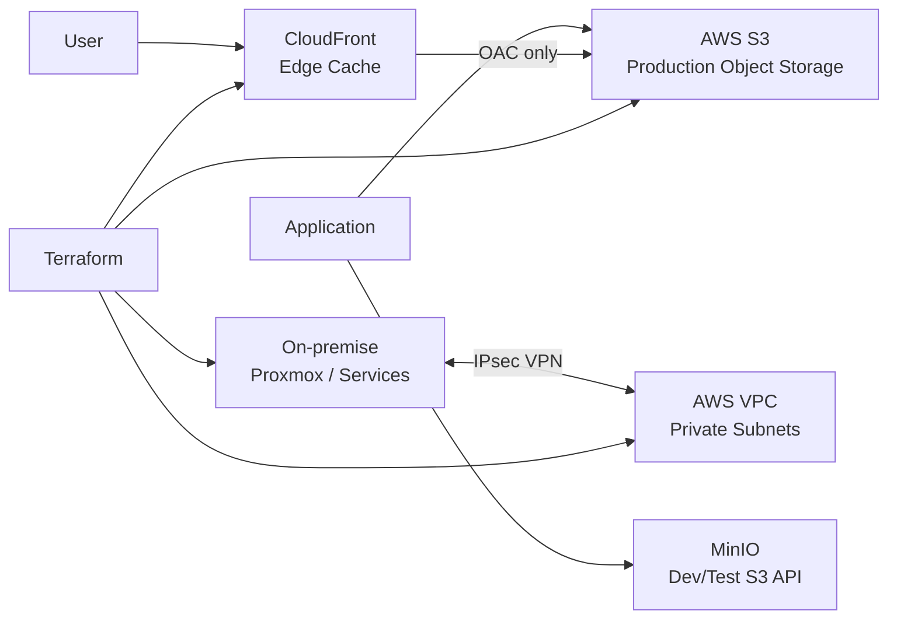
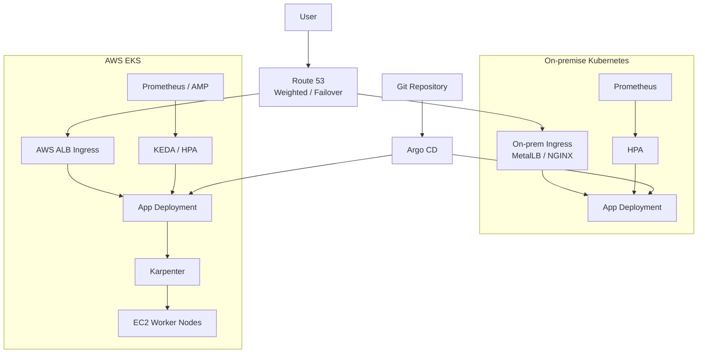

# [Phase 7] Hybrid Cloud: 클라우드 연동 및 서비스 가속

AWS 클라우드 자원을 활용한 글로벌 콘텐츠 전송 및 보안 경계 확장 절차 정리

---

## 1. 정적 자산 가속화 및 오프로딩 (CloudFront)

웹 서버의 부하를 줄이고 전 세계 사용자에게 빠른 응답성을 제공하는 전략

- **CloudFront 배포 최적화:** 엣지 로케이션 캐싱을 통한 Latency 저감
- **실시간 데이터 압축:** Gzip/Brotli 적용을 통한 전송 효율성 극대화

## 2. 보안 스토리지 연동 (S3 & OAC)

민감한 원본 데이터를 보호하고 인가된 경로를 통해서만 접근을 허용하는 체계

- **Origin Access Control (OAC) 도입:** S3 버킷의 직접적인 인터넷 노출 원천 차단
- **버킷 정책 강화:** 최소 권한 원칙에 기반한 정밀한 접근 제어 목록(ACL) 관리

## 3. 하이브리드 네트워킹 및 보안 (Site-to-Site VPN)

온프레미스와 AWS VPC 간의 안전한 논리적 결합 환경 조성

- **Site-to-Site VPN 구축:** IPsec 터널링을 통한 온프레미스-클라우드 간 암호화된 전용 통신망 확보
- **네트워크 격리 및 주소 계획:** IP 충돌 방지를 위한 독립적 대역 분리 및 서브넷 간 라우팅 정책 수립
- **보안 가드레일:** VPN 터널 내 전송 데이터 암호화 및 보안 그룹(SG) 기반의 정밀한 서비스 간 접근 제어

## 4. 하이브리드 Kubernetes 확장 (Cloud Burst)

온프레미스 Kubernetes를 기본 처리 영역으로 두고, AWS EKS를 피크 트래픽과 장애 우회 영역으로 활용하는 확장 모델

- **평상시:** 온프레미스가 대부분의 트래픽 처리, AWS는 최소 리소스 유지
- **부하 증가:** AWS EKS Deployment와 Worker Node를 확장하고 Route 53 가중치를 AWS 쪽으로 증가
- **부하 감소:** AWS Pod/Node를 축소하고 트래픽을 온프레미스 중심으로 복원
- **장애 상황:** 온프레미스 Ingress 또는 회선 장애 시 Route 53 Failover로 AWS ALB Ingress 전환
- **운영 제약:** DB와 파일 업로드 저장소까지 양쪽에 동시 분산하면 지연 시간과 데이터 정합성 관리 난이도가 상승하므로, DB는 한쪽에 고정하고 파일은 S3/MinIO/Ceph RGW 같은 객체 저장소 인터페이스로 추상화

## 5. 목적별 AWS 로드밸런서 선택

| 구분     | 적합한 용도                                      | 본 프로젝트 판단                                       |
| :------- | :----------------------------------------------- | :----------------------------------------------------- |
| **ALB**  | HTTP/HTTPS, 경로/호스트 기반 라우팅, WAF 연동    | 웹 앱·API·EKS Ingress 진입점의 기본 선택               |
| **NLB**  | TCP/UDP, 고정 IP, 낮은 지연 시간, DB 프록시 전면 | ProxySQL, TCP 서비스, 고정 IP 요구가 있을 때 제한 적용 |
| **GWLB** | 방화벽, IDS/IPS, 보안 장비 삽입                  | 고급 보안 장비 연동 과제로 분리                        |

로드밸런서는 성능 우열이 아니라 트래픽 성격에 따라 선택함. 일반 HTTP/HTTPS 서비스는 ALB, L4 TCP/UDP 서비스는 NLB, 보안 장비 체인은 GWLB 기준으로 분류함.

## 6. 하이브리드 자동화 관리 (Hybrid IaC)

온프레미스와 클라우드 리소스를 단일 파이프라인에서 관리하는 기법

- **Terraform AWS Provider 활용:** S3 버킷, CloudFront Distribution, ACM 인증서의 선언적 프로비저닝
- **하이브리드 가시성:** 클라우드 리소스 사용량 및 비용에 대한 통합 모니터링 연동

---

## 상세 구현 및 명세

- **상세 구현 지침서:** [IMPLEMENTATION.md](./IMPLEMENTATION.md)
- **실구축 명세서:** [AS_BUILT.md](./AS_BUILT.md)
