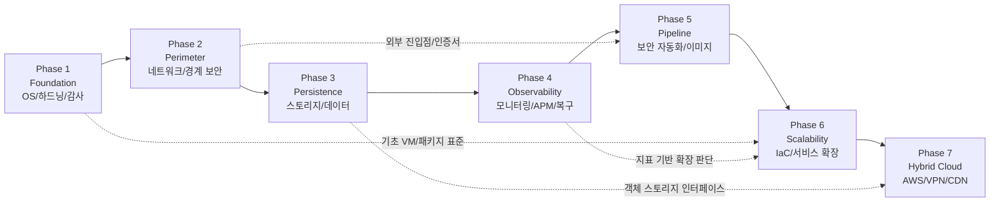

# Cloud Infrastructure Technical Blueprint (Phase 1-7)

**목적:** 엔터프라이즈급 보안 표준 환경 구축을 위한 단계별 기술 요구사항 및 설계 원칙 정의
**핵심 원칙:** 보안(Security), 가용성(Availability), 자동화(Automation), 최적화(Optimization)

---

## Phase Dependency Map

## Phase 1: Foundation (기초 시스템 및 OS) {: #phase-1 }

**목표:** OS 안정성 확보 및 시스템 보안 하드닝 기초 수립

- **가상화 전략:**
  - Proxmox VE: 프라이빗 클라우드 구축을 위한 메인 하이퍼바이저로 운용
  - VMware: 로컬 샌드박스 및 프로토타입 검증용 보조 환경으로 활용
- **유지보수 자동화:**
  - `unattended-upgrades`: 보안 패치 자동 적용을 통한 제로데이 취약점 노출 최소화
  - 시스템 최적화: `apt autoremove` 및 `apt clean`을 이용한 디스크 잔여 패키지 제거 및 파일 시스템 안정성 유지
- **접근 제어 (Access Control):**
  - SSH 하드닝: `PasswordAuthentication no`, `PubkeyAuthentication yes` 설정을 통한 무차별 대입 공격 원천 봉쇄
  - Root 권한 제한: `PermitRootLogin no` 설정 및 일반 계정 접속 후 `sudo` 활용을 통한 권한 상승 이력 관리
- **시스템 감사 (Audit):**
  - `auditd` 정책 수립: `/etc/passwd`, `/etc/shadow`, `/etc/sudoers` 등 핵심 설정 파일의 변경 및 민감 명령어 실행 추적성 확보

## Phase 2: Perimeter (네트워크 및 경계 보안) {: #phase-2 }

**목표:** 네트워크 세분화 및 트래픽 제어를 통한 외부 위협 차단

- **부하 분산 및 가용성:**
  - Nginx 리버스 프록시: 업스트림 서버 부하 분산 및 백엔드 서버의 실제 IP 노출 방지(IP Masking)
- **네트워크 격리 및 고도화:**
  - Public/Private 서브넷 설계: 데이터베이스 및 내부 핵심 서비스를 인터넷으로부터 완전 격리 배치
  - **Bridge/MacVLAN 병행:** 내부 서비스 간 통신은 Docker Bridge 네트워크로 유지하고, 외부 네트워크에서 독립 IP 식별이 필요한 컨테이너만 MacVLAN에 연결
  - **MacVLAN 제약 관리:** MacVLAN 컨테이너는 동일 호스트와 직접 통신할 수 없는 커널 제약이 있으므로, 호스트 연동이 필요한 경우 별도 Bridge 네트워크 또는 호스트 측 macvlan shim 인터페이스를 설계
- **방화벽 정책 (Firewall):**
  - `UFW/IPTables`: `default deny incoming` 원칙 기반의 최소 포트 개방 정책 적용
  - **ICMP(Ping) 제어:** 정보 노출 방지를 위한 선택적 응답 비활성화 및 외부 정찰 차단 전략 수립
- **데이터 전송 보안:**
  - TLS 강제화: 모든 서비스 접점에 HSTS(HTTP Strict Transport Security) 및 TLS 1.3 기반 암호화 통신 적용

## Phase 3: Persistence (데이터 및 스토리지 가용성) {: #phase-3 }

**목표:** SPoF(단일 장애점)가 제거된 고가용성 분산 스토리지 및 객체 저장소 체계 구축
**관련 정책:** [백업 및 복구 정책](../engineering/policies/backup_policy.md)

- **분산 스토리지 (Ceph):**
  - Proxmox 통합 관리: 하이퍼바이저 노드 간 디스크를 통합하여 데이터 삼중화(Replication) 및 자가 복구 구현
  - VM/LXC 영속성 확보: 공유 스토리지 기반의 무중단 라이브 마이그레이션 및 고가용성(HA) 지원
- **사설 객체 저장소 (MinIO):**
  - S3 호환 API 구축: 온프레미스 환경에서 클라우드 네이티브한 파일 관리 체계 수립
  - **운영 전이 전략:** 표준 S3 SDK 인터페이스를 활용하여 개발/검증은 MinIO, 최종 운영은 Phase 7(AWS S3)로 환경 변수 기반 이관을 지원하되, IAM 권한, 버킷 정책, CORS, presigned URL 만료 시간, 멀티파트 업로드 동작은 별도 호환성 검증 수행
- **스토리지 가용성 (RAID/LVM):**
  - 역할 분리: OS/부트 볼륨은 RAID 1 또는 ZFS 미러로 보호하고, Ceph OSD 데이터 디스크는 Ceph 복제와 CRUSH 장애 도메인 관리를 우선하여 전용 디스크(JBOD/IT mode) 구성을 기본값으로 검토
- **컨테이너 데이터 보존:**
  - **Named Volume 및 Bind Mount:** 데이터 성격(DB, 설정, 로그)에 따른 최적화된 마운트 전략 적용으로 데이터 영속성 확보
- **백업 및 복구 전략 (DR Strategy):**
  - **RPO(복구 시점 목표):** 주요 데이터의 일 단위 백업을 통한 유실 범위 제한
  - **RTO(복구 시간 목표):** 자동화 스크립트 및 스냅샷 기능을 활용한 수 시간 이내 서비스 복원 지향

## Phase 4: Observability (운영 가시성 및 성능 최적화) {: #phase-4 }

**목표:** 실시간 모니터링, 성능 튜닝 및 자동 장애 대응 체계 구축을 통한 서비스 가용성 극대화
**관련 정책:** [로그 보존 및 관리 정책](../engineering/policies/log_policy.md)

- **고가용성 유지 (High Availability):**
  - 하이퍼바이저 HA: Proxmox 3노드 이상 클러스터 구성을 통한 노드 장애 시 VM 자동 페일오버 보장
  - 셀프 힐링 (Self-healing): 프로세스 비정상 종료 감지 시 시스템 유닛(Systemd) 또는 별도 스크립트를 통한 자동 재기동 구현
- **성능 분석 및 튜닝 (Optimization):**
  - **애플리케이션 프로파일링:** 범언어 분산 추적은 OpenTelemetry + Grafana Tempo를 우선 검토하고, Java 중심 트랜잭션 분석 실습은 Pinpoint/Scouter를 선택적으로 활용
  - **Stress 기반 검증:** `stress` 도구를 이용한 극한 부하 시뮬레이션 수행 및 자원 할당량(cgroups) 최적화
  - **환경 동기화:** 호스트-컨테이너 간 타임존(Timezone) 일치화를 통한 로그 분석 무결성 확보
- **모니터링 및 알림:**
  - 리소스 임계치 관리: CPU/MEM/DISK 사용률 90% 초과 시 Webhook 기반 즉각 알림 송출
  - **통합 상태 리포트:** 매일 정기적으로 시스템 가동 시간, 실패한 프로세스, Crontab 작업 상태를 요약한 보고서 자동 생성
- **로그 및 서비스 최적화:**
  - `Logrotate`: 로그 로테이션 및 압축을 통한 디스크 풀(Full) 장애 예방
  - Nginx 튜닝: 정적 파일 캐싱 및 Gzip 압축 적용을 통한 응답 지연 시간 최적화

## Phase 5: Pipeline (보안 자동화 및 이미지 관리) {: #phase-5 }

**목표:** 공급망 보안 강화 및 인프라 변경 신뢰성 확보

- **로컬 보안 검증 (Local Security):**
  - `pre-commit`/`Gitleaks`: 로컬 스테이징 단계에서 API Key, Secret Token 등 민감 정보 유출 사전 차단
- **지속적 통합 보안 (CI Security):**
  - `Semgrep`: SAST 기반의 소스 코드 내 보안 취약점(Insecure Patterns) 탐지 자동화
  - `pnpm audit` / `pip-audit`: 프로젝트 종속성 라이브러리(Node.js, Python)의 알려진 취약점(CVE) 스캔 및 업그레이드 유도. `pnpm audit`은 프론트엔드/풀스택 CI 파이프라인 시나리오 학습 목적을 포함
- **기업형 이미지 관리:**
  - **Harbor Registry:** 사설 저장소 구축을 통한 이미지 권한 관리 및 내장 엔진 기반 취약점 자동 스캔 연동
- **패키지 검사:**
  - `Trivy`: 컨테이너 이미지 아티팩트 및 OS 패키지의 보안 결함 분석 후 Slack 연동 통보

## Phase 6: Scalability (IaC 및 서비스 확장) {: #phase-6 }

**목표:** 인적 실수 배제 및 인프라 프로비저닝 자동화

- **인프라 프로비저닝 (IaC):**
  - Terraform: Proxmox API 연동을 통한 선언적 방식의 VM 생성 및 환경 복제 자동화
- **구성 관리 (Configuration Management):**
  - Ansible Playbook: 모든 서버의 보안 설정 및 패키지 구성을 코드화하여 환경 일관성(Idempotency) 유지
- **심화 로드맵:**
  - **설정 및 배포 자동화:** Helm Chart 기반 패키징 및 Argo CD를 활용한 GitOps 운영 체계 구축
  - **서비스 메시(고급):** Istio 사이드카 도입을 통한 정밀 트래픽 제어 및 서비스 간 mTLS 보안 강화
  - DB 가용성 고도화: MariaDB Galera Cluster 기반의 동기식 이중화 및 ProxySQL 부하 분산 구현. 쓰기 지연과 충돌 가능성이 있는 워크로드는 MariaDB Replication + ProxySQL 읽기/쓰기 분리 대안도 함께 평가
  - **오토 스케일링:** 트래픽 부하에 따른 리소스 동적 할당 및 인스턴스 확장 체계 연구. 운영 표준은 장애 도메인 분산이 가능한 다중 인스턴스 기반 수평 확장을 우선 적용
  - 하이브리드 연계 준비: Phase 7에서 사용할 환경별 설정 분리, 배포 자동화, 오토스케일링 기준 수립

## Phase 7: Hybrid Cloud (AWS Integration) {: #phase-7 }

**목표:** 클라우드 리소스 연동을 통한 서비스 가속 및 보안 경계 확장

- **하이브리드 네트워킹(Site-to-Site VPN):**
  - 안전한 논리적 결합: IPsec 기반 암호화 터널링을 통한 온프레미스-클라우드 간 전용 통신망 구축
  - **보안 격리:** VPN 터널 내 전송 데이터 암호화 및 보안 그룹 기반의 서비스 격리 체계 수립
- **클라우드 스토리지 (S3):**
  - 정적 자산 오프로딩(Offloading): 서버 I/O 부하 절감을 위해 대용량 파일 및 정적 데이터를 S3로 이관
  - **보안 강화(OAC):** S3 버킷에 대한 직접 접근을 차단하고 오직 CloudFront를 통한 인가된 접근만 허용
  - **데이터 마이그레이션:** MinIO 기반 온프레미스 데이터를 `mc mirror`를 통해 AWS S3로 안전하게 이관하는 하이브리드 워크플로우 정립
- **글로벌 전송 가속 (CDN):**
  - **CloudFront 도입:** 전 세계 엣지 로케이션 캐싱을 통한 응답 지연 시간(Latency) 최소화
  - 전송 암호화: ACM 인증서 기반의 전 구간 HTTPS 통신 및 TLS 최신 프로토콜 적용
- **하이브리드 자동화 (IaC):**
  - Terraform 기반 관리: 온프레미스(Proxmox)와 클라우드(AWS) 리소스를 단일 코드로 통합 프로비저닝
  - **운영 가시성:** 클라우드 리소스 사용량 및 비용에 대한 통합 모니터링 체계 수립
