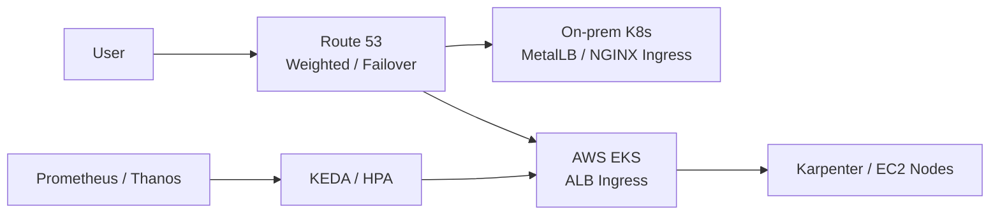

# 하이브리드 네트워킹 및 보안 전략 (Site-to-Site VPN)

본 문서는 온프레미스(Proxmox)와 클라우드(AWS) 간의 안전한 논리적 통신망 구축을 위한 표준 아키텍처 및 보안 지침 정리

---

## 1. 하이브리드 네트워크 아키텍처

- **Site-to-Site VPN:** IPsec 터널링 기반의 암호화된 전용 통신망 구성
- **주소 체계 분리:** 온프레미스(192.168.x.x)와 AWS VPC(10.x.x.x) 간의 IP 대역 충돌 방지를 위한 CIDR 범위 사전 분리
- **트래픽 진입점 분리:** 온프레미스는 Nginx Ingress/MetalLB, AWS는 ALB Ingress를 외부 진입점으로 두고 Route 53 가중치(Weighted) 또는 장애 조치(Failover) 라우팅으로 유입 비율 제어

## 2. 보안 가드레일 (Security Guardrails)

- **전송 데이터 암호화:** VPN 터널 내 전송 데이터의 IPsec 기반 암호화 강제
- **접근 제어 강화:** 보안 그룹(SG) 기반의 정밀한 서비스 간 포트 격리 정책 수립
- **mTLS 연동:** Istio 등 서비스 메시 도입 시 VPN 통신 위에서 추가적인 엔드-투-엔드 인증 병행 권장

## 3. 운영 전략 (Operational Strategy)

- **고가용성 유지:** 터널 장애 시 대체 라우팅 경로 확보 및 자동 재연결 설정
- **모니터링:** VPN 터널 상태 및 트래픽 양에 대한 실시간 관제 연동

## 4. 클라우드 버스트 확장 기준 (Cloud Burst)

온프레미스와 AWS를 하나의 Kubernetes 클러스터로 강제 결합하는 방식은 네트워크, CNI, 인증서, 노드 조인 자동화 난이도가 높음. 본 프로젝트의 표준 전략은 **온프레미스 Kubernetes와 AWS EKS를 분리 운영**하고, 트래픽 라우팅과 GitOps로 배포 상태를 맞추는 방식임.

- **평상시:** Route 53 가중치 라우팅으로 대부분의 트래픽을 온프레미스 Ingress에 전달하고, EKS는 최소 Pod/Node만 유지
- **부하 증가:** Prometheus 지표를 기준으로 KEDA/HPA가 AWS 쪽 Pod를 확장하고, 노드 부족 시 Karpenter 또는 Cluster Autoscaler가 EC2 Worker Node 생성
- **부하 감소:** AWS Pod와 Node를 축소하고 Route 53 가중치를 온프레미스 중심으로 복원
- **장애 우회:** 온프레미스 Ingress 또는 회선 장애 시 Route 53 Failover로 AWS ALB Ingress 전환

