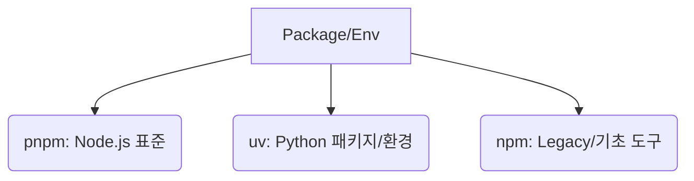

# [Knowledge Base] 개발자 생산성 및 도구 활용 가이드

본 문서는 프로젝트 협업 효율성 증대와 표준화된 개발 환경 유지를 위한 필수 도구 및 생산성 지침 정리

---

## 1. VS Code 생산성 최적화

- **GitGraph / GitLens:** 복잡한 브랜치 구조 및 코드 변경 이력(누가, 언제, 왜)의 시각적 추적 및 분석
- **WordWrap:** 문서 가독성 향상을 위한 자동 줄바꿈 활성화 (마크다운 필수 설정)
- **Reveal in File Explorer / Copy Path / ctrl+shift+p :** 탐색기 직관적 이동 및 파일 경로의 신속한 클립보드 복사

## 2. Git 표준 협업 및 히스토리 관리

- **커밋 메시지 포맷 (Conventional Commits):**
  - `type: 주제` 구조(예: `feat:`, `fix:`, `refactor:`, `docs:`) 준수를 통한 자동화된 변경 이력 관리
- **히스토리 관리:** `git-filter-repo`(uv tool)를 활용한 시크릿 정보 일괄 삭제 및 커밋 이력 정제 (`playbooks/dev/git_history_cleanup_guide.md` 참조)

## 3. 코드 비교(Compare) 및 검증

- **도구 활용:** `VSCode`, `WinMerge` 또는 `Notepad++`의 Compare 플러그인을 활용한 설정 파일 및 텍스트 간 차이점 정밀 대조

## 4. 품질 관리 및 자동화 가이드

- **Prettier의 필요성:**
  - AI 모델은 코드 논리 생성에는 탁월하나 에디터별 포맷팅 일관성 유지에는 한계 존재
  - **자동 포맷팅 강제:** `pre-commit` 훅을 통한 저장 시점의 자동 포맷팅으로 코드 스타일 흩어짐 방지 및 리뷰 비용 최소화
- **Pre-commit 개념:** 커밋 단계에서 코드 품질(Lint, Security)을 자동으로 검증하는 품질 게이트웨이(Quality Gateway) 역할

## 5. 최신 패키지 관리 도구(Modern Toolchain)

인프라 관리자도 기본적으로 숙지해야 하는 차세대 도구 체인

- **pnpm:** 심볼릭 링크 구조를 통한 디스크 효율성 및 설치 속도 극대화 (Node.js 표준)
- **uv:** Poetry/pip를 대체하는 Rust 기반 초고속 파이썬 패키지 관리 및 가상 환경 도구
- **Gemini CLI:** AI 기반의 자동화 작업을 위한 CLI 도구 활용 (무료 티어 기반의 워크플로우 연동)

## 6. 추가 유용한 생산성 팁

- **ShellCheck:** 셸 스크립트 작성 시 잠재적 버그 및 문법 오류 사전 진단
- **Docker/K8s 관련 도구:**
  - **Lens / K9s:** 쿠버네티스 클러스터의 실시간 상태 모니터링 및 터미널 기반 관리
- **환경 구성 지침:** `ENVIRONMENT_SETUP.md`를 기반으로 한 신규 참여자의 환경 일관성 확보
