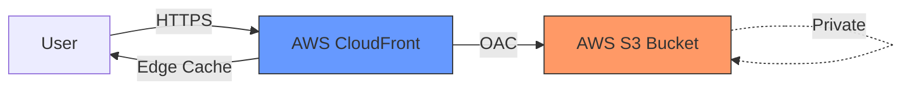

# AWS S3 & CloudFront 가속 및 보안 전략 (Cloud Edge Strategy)

본 문서는 정적 자산의 글로벌 가속 및 보안 강화를 위해 AWS S3와 CloudFront를 연동하는 표준 아키텍처와 관리 원칙 정리

---

## 1. 핵심 아키텍처 개요 (Architecture)



- **S3 (Storage):** 원본 데이터(정적 파일)의 안전한 보관소. 직접 외부 노출 차단.
- **CloudFront (CDN):** 전 세계 엣지 로케이션을 통한 콘텐츠 캐싱 및 가속 수행.
- **OAC (Origin Access Control):** S3 버킷 권한을 CloudFront 서비스로만 한정하여 우회 접속 원천 봉쇄.

---

## 2. 가속 및 최적화 전략 (Performance)

- **전역 가속 (Global Acceleration):** 엣지 로케이션 캐싱을 통한 물리적 거리 기반 응답 지연(Latency) 최소화.
- **캐시 정책(TTL) 최적화:**
  - 정적 자산(이미지, JS 등)은 긴 TTL 부여로 캐시 히트율(Hit Ratio) 극대화.
  - 업데이트 잦은 설정 파일은 `CloudFront Invalidation`을 통한 수동 갱신 수행.
- **전송 압축 (Gzip/Brotli):** 전송 시 실시간 압축 적용을 통한 데이터 전송량 절감 및 로딩 속도 향상.

---

## 3. 보안 가드레일 (Security Guardrails)

- **OAC 기반 버킷 보안 정책 (Bucket Policy):**
  ```json
  {
    "Version": "2012-10-17",
    "Statement": {
      "Sid": "AllowCloudFrontServicePrincipalReadOnly",
      "Effect": "Allow",
      "Principal": { "Service": "cloudfront.amazonaws.com" },
      "Action": "s3:GetObject",
      "Resource": "arn:aws:s3:::your-bucket-name/*",
      "Condition": {
        "StringEquals": {
          "AWS:SourceArn": "arn:aws:cloudfront::123456789012:distribution/ED..."
        }
      }
    }
  }
  ```
- **전송 구간 암호화:** ACM(AWS Certificate Manager) 인증서 기반의 전 구간 HTTPS 통신 강제.
- **WAF 연동:** SQL 인젝션, XSS 공격 등 악성 트래픽 차단을 위한 Web Application Firewall 적용.

---

## 4. 코드형 인프라 구현 (Terraform)

```hcl
# S3 버킷 생성
resource "aws_s3_bucket" "static_assets" {
  bucket = "kosa-infra-assets"
}

# CloudFront 배포 및 OAC 연결
resource "aws_cloudfront_distribution" "s3_distribution" {
  origin {
    domain_name              = aws_s3_bucket.static_assets.bucket_regional_domain_name
    origin_access_control_id = aws_cloudfront_origin_access_control.default.id
    origin_id                = "S3Origin"
  }
  enabled             = true
  default_root_object = "index.html"
  # (이후 캐시 및 SSL 설정 생략)
}
```

---

## 5. 온프레미스(MinIO)에서 클라우드(S3)로의 전이 전략

성공적인 하이브리드 운영을 위한 단계별 승격(Promotion) 시나리오

- **표준 인터페이스 준수:** 애플리케이션 개발 시 특정 벤더에 종속되지 않는 표준 S3 SDK(Boto3, aws-sdk-js 등) 사용 강제.
- **환경 변수 기반 스위칭:**
  - **Development (MinIO):** `S3_ENDPOINT=http://minio.local:9000`, `USE_SSL=false`
  - **Production (AWS S3):** `S3_ENDPOINT=https://s3.ap-northeast-2.amazonaws.com`, `USE_SSL=true`
- **데이터 마이그레이션:** MinIO 클라이언트(`mc`)의 `mirror` 기능을 활용하여 온프레미스 데이터를 AWS S3 버킷으로 동기화.
  - **명령어:** `./mc mirror myminio/infra-assets awss3/kosa-infra-assets`

---

## 6. 하이브리드 네트워킹 및 보안 설계 (VPC)

클라우드 리소스 연동을 위한 논리적 격리 환경 및 보안 계층 수립

- **서브넷 격리:** 퍼블릭(IGW 연결) 및 프라이빗(내부 전용) 서브넷 분리를 통한 공격 표면 최소화.
- **다중 방화벽 체계:**
  - **보안 그룹 (Stateful):** 인스턴스 단위 허용 규칙 적용. 응답 트래픽 자동 허용.
  - **네트워크 ACL (Stateless):** 서브넷 단위 허용/거부 규칙 적용. 임시 포트(Ephemeral Ports) 개방 필수.

---

## 7. 목적 기반 데이터베이스 선정 전략 (Purpose-built DB)

데이터 특성에 따른 최적의 AWS 관리형 DB 서비스 매핑

| 서비스명         | 데이터 모델    | 주요 활용 사례                                       |
| :--------------- | :------------- | :--------------------------------------------------- |
| **RDS / Aurora** | 관계형 (RDBMS) | 강력한 데이터 정합성 요구 서비스 (금융, 관리 시스템) |
| **DynamoDB**     | 키-값 (NoSQL)  | 대규모 고속 처리, 세션 관리, 실시간 웹 애플리케이션  |
| **ElastiCache**  | 인 메모리      | 데이터 캐싱 및 DB 부하 절감 오프로딩                 |

---

## 8. 결론 및 제언

- S3/CDN 조합은 서버의 I/O 부하를 획기적으로 줄이는 **'인프라 오프로딩(Offloading)'**의 핵심 기술임.
- 온프레미스(Proxmox) 서비스와의 하이브리드 연동 시, 클라우드 자격 증명 관리를 위해 **`IAM Roles`** 또는 **`Vault`** 연동을 권장함.
