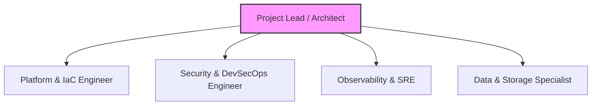
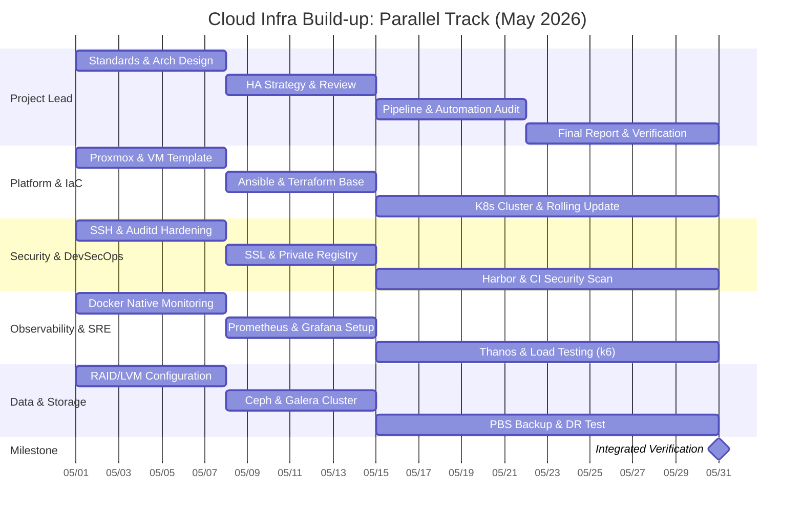
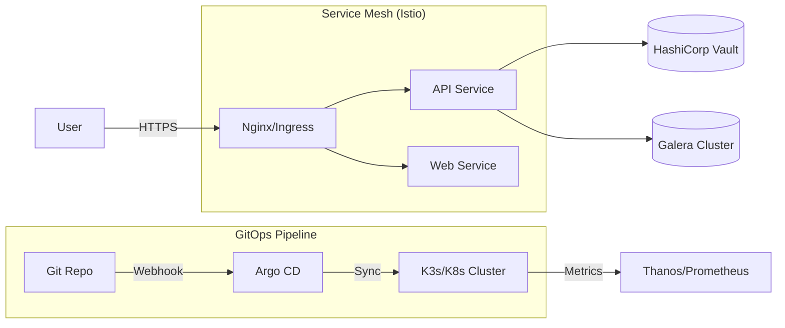

# 팀 협업 모델 및 프로젝트 확장 전략 (Team Collaboration & Expansion)

본 문서는 4~5인 규모의 팀이 한 달간 프로젝트를 수행할 때의 역할 분담 최적화 방안 및 고도화 확장 시나리오 정리

---

## 1. 팀 역할 분담 모델 (Team Roles & Responsibilities)

4~5인 구성 시, 기술적 의존성과 작업 부하를 고려한 역할 매핑

| 역할                        | 주요 담당 범위 (R&D 및 구축)                                         | 관련 Phase |
| :-------------------------- | :------------------------------------------------------------------- | :--------- |
| **Project Lead (1인)**      | 전체 아키텍처 설계, 문서화 표준화, 최종 통합 검증 및 PM              | 전 공통    |
| **Platform & IaC (1인)**    | Proxmox 클러스터, Terraform/Ansible 자동화, k3s/k8s 기반 인프라 구축 | Phase 1, 6 |
| **Security Engineer (1인)** | Harbor 보안 설정, CI/CD 보안 파이프라인(SCA/SAST), mTLS 및 인증 체계 | Phase 2, 5 |
| **Observability/SRE (1인)** | Thanos 모니터링, Grafana 대시보드, 셀프 힐링 로직, k6 성능 벤치마킹  | Phase 4    |
| **Data Specialist (0~1인)** | Ceph 분산 스토리지, Galera DB 클러스터, PBS 백업 및 DR 전략 수립     | Phase 3, 6 |

---

## 2. 역할 기반 병렬 로드맵 (Role-based Parallel Roadmap)

4~5인 팀이 각자의 전문 영역에서 동시에 수행하는 주차별 핵심 태스크 명세

### 2.1 1주차: 인프라 기반 및 보안 하드닝 (Foundation)

- **Architect:** 전체 네트워크 대역 설계, Git 저장소 환경 및 협업 표준(Husky) 수립
- **Platform:** Proxmox 클러스터 구축, Cloud-init 기반 표준 VM 템플릿 생성 및 배포
- **Security:** SSH 보안 정책 및 `auditd` 감사 규칙 적용, UFW 방화벽 기본 가드레일 수립
- **SRE:** Docker Native 관측 환경(`stats`, `events`) 구성 및 시스템 레벨 셀프 힐링 로직 설계
- **Data:** 각 물리 노드의 RAID/LVM 스토리지 계층 무결성 확보 및 기본 파티셔닝 수행

### 2.2 2주차: 가용성 스택 및 저장소 연동 (Persistence)

- **Architect:** HA 계층형 가용성 전략 수립 및 DB/Storage 복제 아키텍처 검토
- **Platform:** Ansible/Terraform 초기 코드 작성 및 공통 패키지 자동 설치 플레이북 정립
- **Security:** 사설 도메인 기반 HTTPS 인증서 체계 구축 및 HTTPS Docker Registry 가동
- **SRE:** Prometheus/Grafana 베이스 모니터링 환경 구축 및 얼럿 매니저 연동
- **Data:** Ceph 분산 스토리지 풀 구성 및 MariaDB Galera Cluster 멀티 마스터 설정

### 2.3 3주차: 보안 파이프라인 및 자동화 통합 (Pipeline)

- **Architect:** 공급망 보안 무결성 검증 및 최종 결과물 발표 시나리오 구성
- **Platform:** IaC 코드를 활용한 멀티 노드 확장 및 k3s/k8s 클러스터 프로비저닝
- **Security:** Harbor 레지스트리 보안 스캔 연동 및 CI 파이프라인(SCA/SAST) 가드레일 삽입
- **SRE:** Thanos 기반 장기 메트릭 보존 체계 구축 및 중앙 집중형 로깅 스택 구성
- **Data:** PBS(Proxmox Backup Server) 연동을 통한 이미지 레벨 자동 백업 및 복구 테스트

### 2.4 4주차: 최적화, 검증 및 자산화 (Optimization)

- **Architect:** 프로젝트 전체 통합 검증 수행 및 최종 기술 보고서/발표 자료 완결
- **Platform:** 무중단 롤링 업데이트 로직 구현 및 인프라 프로비저닝 최종 최적화
- **Security:** 자격 증명 암호화 보관(Pass) 적용 및 시크릿 관리 고도화(Vault 검토)
- **SRE:** `k6` 기반 부하 테스트 수행 및 p95 지연 시간 분석을 통한 성능 튜닝 보고서 작성
- **Data:** 데이터 복구 시나리오(DR) 실현 및 분산 스토리지 성능 최적화 파라미터 튜닝

---

## 3. 프로젝트 마스터 일정 (Role-based Master Schedule)

역할별 병렬 트랙 및 상호 업무 의존성을 고려한 전 공정 시각화

---

## 4. 프로젝트 확장 시나리오 (Scaling Options)

4~5인이 한 달간 수행하기에 현재 규모가 부족할 경우, 전문성을 극대화하기 위한 확장 포인트

### 3.1 제로 트러스트 보안 고도화 (Zero-Trust Security)

- **Service Mesh (Istio) 도입:** 서비스 간 모든 통신에 대한 상호 TLS(mTLS) 암호화 및 세밀한 트래픽 정책 적용.
- **HashiCorp Vault 연동:** 모든 비밀번호와 API 키를 동적으로 생성/관리하는 보안 보관소 통합.

### 3.2 GitOps 및 IDP 구축 (Internal Developer Platform)

- **Argo CD 통합:** 선언적 GitOps 배포 체계를 구축하여 "Git 커밋이 곧 배포"인 환경 구현.
- **Backstage 도입:** 개발자가 버튼 하나로 표준 인프라 환경을 프로비저닝할 수 있는 셀프 서비스 포털 구축.

### 3.3 지능형 운영 (AI Ops & FinOps)

- **예측형 오토스케일링:** MS AI 모델 등을 활용하여 과거 부하 패턴 기반 선제적 자원 확장 로직 구현.
- **Kube-cost 연동:** 클러스터 리소스 사용량 대비 실제 비용(가상)을 산정하고 비용 효율성 대시보드 구축.

### 3.4 AWS 하이브리드 클라우드 확장 (Cloud Extension)

- **S3 & CloudFront 연동:** 온프레미스 서버의 정적 자산을 AWS S3로 이관하고, CloudFront를 통해 전 세계 가속 및 보안 가드레일(OAC) 수립.
- **상세 전략:** [AWS S3 & CloudFront 가속 전략](./aws_s3_cloudfront_strategy.md) 참조.

### 3.5 멀티 가용 영역(Multi-AZ) 인프라

- **사이트 간 복제:** 물리적으로 떨어진 두 개 이상의 서버 환경 간 데이터 실시간 동기화 및 재해 복구(DR) 시나리오 실현.

---

## 4. 확장 아키텍처 조감도

---

## 5. 결론 및 제언

- 본 프로젝트는 **'엔터프라이즈 인프라의 표준'**을 지향하므로, 인원과 시간이 허락한다면 **'보안(Vault/Mesh)'**과 **'자동화(GitOps)'** 영역을 깊게 파고드는 것이 가장 효과적인 확장 전략임.
- 각 팀원은 담당 영역의 **AS_BUILT(명세서)**와 **IMPLEMENTATION(지침서)** 작성을 병행하여 기술 자산화에 기여해야 함.
