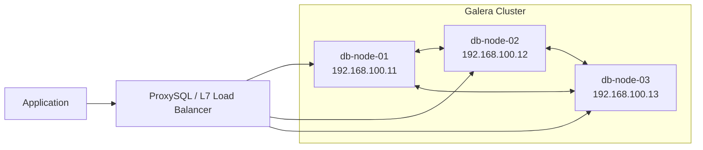

# [Step 6-2] MariaDB Galera Cluster 고가용성 구축

본 실습에서는 MariaDB Galera Cluster를 활용하여 데이터 유실 없는 동기식 멀티 마스터 DB 환경 구축

---

## 1. 아키텍처 설계 (Architecture)



- **동기식 복제:** 한 노드에 쓰기 발생 시 모든 노드에 쓰기 완료가 보장되어야 커밋 성공
- **멀티 마스터:** 모든 노드에서 읽기/쓰기가 가능하여 부하 분산 및 즉각적인 장애 조치 가능
- **쿼럼(Quorum):** 3개 노드 구성을 통해 스플릿 브레인 방지 및 과반수 합의 체계 유지

---

## 2. 사전 네트워크 요구사항 (Networking)
클러스터 통신을 위해 아래 포트의 방화벽(UFW) 개방 필수

- **3306/tcp:** MariaDB 클라이언트 연결
- **4567/tcp:** Galera 클러스터 복제 트래픽 (Multicast UDP 포함 가능)
- **4568/tcp:** IST (Incremental State Transfer) 증분 상태 전송
- **4444/tcp:** SST (State Snapshot Transfer) 전체 상태 전송

---

## 3. 구축 절차 (Overview)

### 3.1 VM 프로비저닝 (Proxmox)
- **대상:** Ubuntu 24.04 LTS 가상 머신 3대
- **사양:** CPU 2 Core, RAM 2GB, DISK 20GB 이상 추천
- **권장 방식:** 1번 노드 설정 완료 후 Proxmox 'Clone' 기능을 활용하여 2, 3번 노드 신속 생성

### 3.2 패키지 설치
```bash
sudo apt update
sudo apt install -y mariadb-server mariadb-client
```

### 3.3 클러스터 설정 (`galera.cnf`)
- `/etc/mysql/mariadb.conf.d/60-galera.cnf` 파일 생성 및 설정
- 주요 파라미터:
    - `wsrep_on=ON`
    - `wsrep_provider=/usr/lib/galera/libgalera_smm.so`
    - `wsrep_cluster_address="gcomm://192.168.100.11,192.168.100.12,192.168.100.13"`
    - `binlog_format=ROW`
    - `default_storage_engine=InnoDB`

---

## 4. 가용성 검증 테스트
- **데이터 동기화:** 1번 노드에서 생성한 DB/Table이 2, 3번 노드에서 즉시 조회되는지 확인
- **장애 조치:** 1번 노드 서비스 강제 중단(`systemctl stop mariadb`) 후 2, 3번 노드 서비스 지속 여부 확인
- **자동 복구:** 중단된 1번 노드 재기동 시 IST/SST를 통한 데이터 자동 동기화 확인
