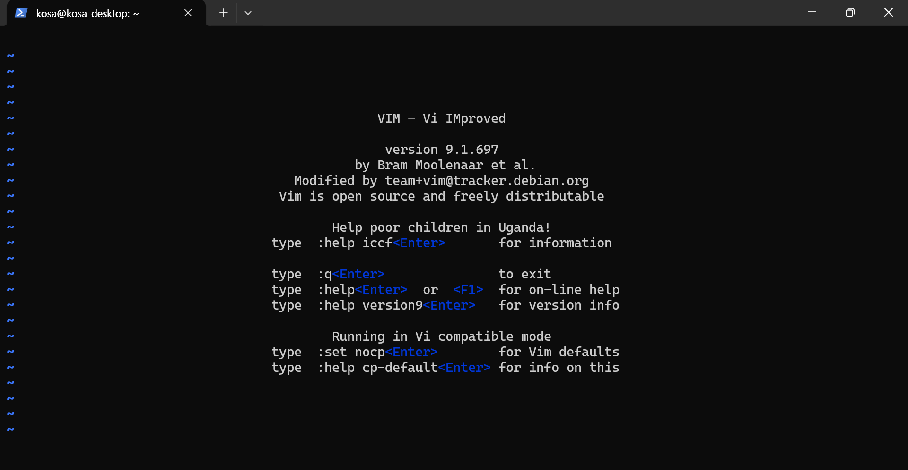
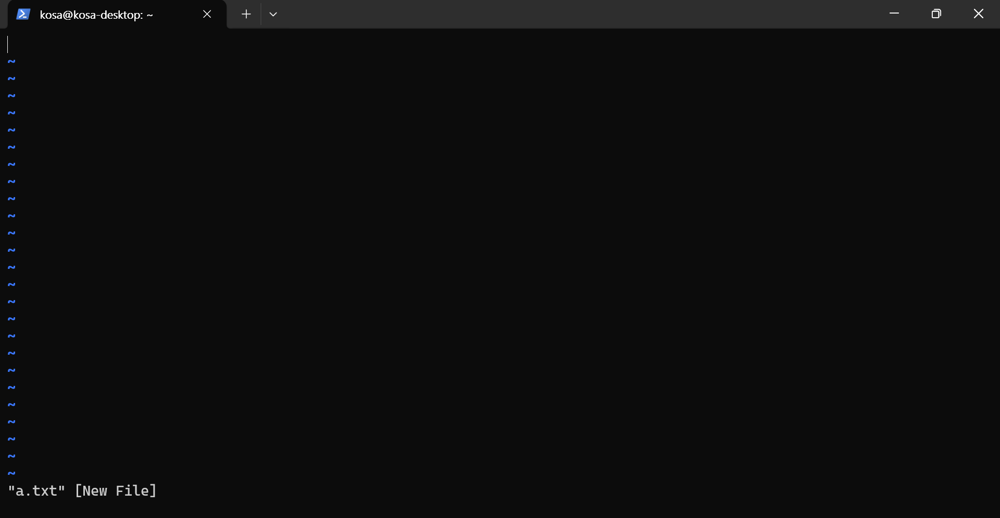

# vi 편집기 

리눅스 에디터는 대표적으로 vi 와 vim이 있습니다.

vim은 vi improved의 약자입니다.

향상된 vi라는 것에서 알 수 있듯이 vi보다 편리하게 사용할 수 있도록 향상시킨 것입니다.

vim 설치

```bash
sudo apt install vim 
```

가장 큰 차이로는 vim은 에디터에서 화살표 방향키로 커서의 이동이 되지만, vi는 방향키가 아닌 h, j, k, l로 커서를 이동 할 수 있습니다.

vi 에디터를 실행하려면 vi를 입력하면됩니다.

```bash
vi 
```

실행 화면 



만약, a.txt라는 파일을 만들면서 편집하고 싶으면 파일명을 뒤에 붙여 주시면 됩니다.

```bash
vi a.txt
```

실행화면



이렇게 시작하자마자 접하게 되는 모드를 명령 모드라고 합니다.
 

vi의 세 가지 모드
vi 에디터에는 명령 모드, 입력 모드, ex 명령 모드가 있습니다.

- 명령 모드는 vi를 실행시키면 가장 먼저 접하는 모드로 커서의 이동, 수정, 삭제, 복사 등을 합니다.
- 입력 모드 전환키인 i, a, o, I, A, O 등을 입력하면 입력 모드로 전환되고, 명령 모드로 다시 전환하려면 esc 키를 누르면 됩니다.
입력 모드는 편집 모드, input 모드, insert 모드 등으로 불리며, 메모장처럼 문서를 편집할 수 있는 모드입니다.
- 명령 모드에서 입력 전환키를 눌러서 전환하면 화면 아래에 '--INSERT--'라고 표시됩니다.
- ex 명령모드는 클론 모드라고도 불리며 명령 모드에서 : 키를 눌러 전환 할 수 있습니다.
- 화면 맨 아랫줄에서 명령을 수행하는 모드로 저장, 종료, 탐색, vi 환경 설정 등의 역할을 하는 모드입니다.
 

이제 명령어에 대해서 알아보겠습니다.

- 실행모드에서 입력모드로 전환해야 합니다.

명령모드에서 입력모드로 전환

a : 현재 커서 다음 칸부터 입력

A : 현재 커서의 줄 맨 마지막 부터 입력

i :  현재 커서 위치부터 입력

I : 현재 커서줄의 맨 앞부터 입력

o : 현재 커서의 다음 줄에 입력

O : 현재 커서의 이전 줄에 입력

s : 현재 커서 위치의 한 글자를 지우고 입력

S : 현재 커서의 한 줄을 지우고 입력


- 입력모드에서 커서를 옮기기 위해서는 명령 모드로 전환해합니다.

- 입력모드에서 명령모드로 전환

ESC키

- 커서 이동 명령어

    - h : 커서를 왼쪽으로 한칸 이동 ( ← )
    - j : 커서를 아래로 한 칸 이동 ( ↓ )
    - k : 커서를 위로 한 칸 이동 ( ↑ ) 
    - l : 커서를 오른쪽으로 한 칸 이동 ( → )
    - w : 다음 단어의 첫 글자로 이동
    - b : 이전 단어의 첫 글자로 이동
    - G : 마지막 행으로 이동

- :숫자 : 지정한 숫자 행으로 이동

    - Ctrl + f : 다음 화면으로 이동 ( Page Down과 같음 )
    - Ctrl + b : 이전 화면으로 이동 ( Page Up과 같음 )
    - Ctrl + d : 스크롤 중간 정도 내리기

- 되돌리기

    - u : Ctrl + z 와 같은 기능 

- 다시실행

    - Ctrl + r : 되돌리기 한 것을 다시 실행하기

- 삭제

    - x : 커서에 있는 글자 삭제
    - X : 커서 앞에 있는 글자 삭제
    - dw : 커서를 기준으로 뒤에 있는 단어 삭제(커서 포함)
    - db : 커서를 기준으로 앞에 있는 단어 삭제
    - dd : 커서가 있는 줄 삭제

 삭제 명령어 앞에 숫자를 붙이면 숫자만큼 삭제를 한다.

삭제된 내용은 버터에 저장되어 붙여넣기가 가능하다.

ex) 5dd면 5줄 삭제

- 복사

    - yy : 커서가 있는 줄 복사
    - yw : 커서를 기준으로 뒤에 있는 단어 복사(커서 포함)
    - yb : 커서를 기준으로 앞에 있는 단어 복사

복사 명령어 또한, 앞에 숫자를 붙이면 복사할 숫자를 정할 수 있다.

- 붙여넣기

    - p : 커서 다음에 붙여넣기
    - P : 커서 이전에 붙여넣기

- 찾기

    - /문자열 : 앞에서 부터 문자열을 찾는다
    - ?문자열 : 뒤에서 부터 문자열을 찾는다
    - n : 뒤로 검색
    - N : 앞으로 검색

- 바꾸기

    - :%s/찾을단어/바꿀단어 : 각 행의 처음 나오는 찾을단어를 찾아 바꿀단어로 바꾼다.
    - :%s/찾을단어/바꿀단어/g : 모든 찾을 단어를 찾아 바꿀 단어로 바꾼다.
    - :%s/찾을단어/바꿀단어/gc : 모든 찾을단어를 바꿀단어로 바꾸기전에 물어본다.

- 저장, 종료하기

    - :q : 종료 (저장하지 않고 실행하면 오류 발생)
    - :q! : 저장하지 않고 종료
    - :w : 저장
    - :wq : 저장 후 종료
    - :wq 파일 이름 : 저장후 파일 이름 지정

- 이 외 기능들

    - :set number : 행 번호를 출력 ( :set nu 라고도 한다)
    - :set nonumber : 행 번호 숨김 (:set nonu 라고도 한다)
    - :cd : 현재 디렉토리 출력

 