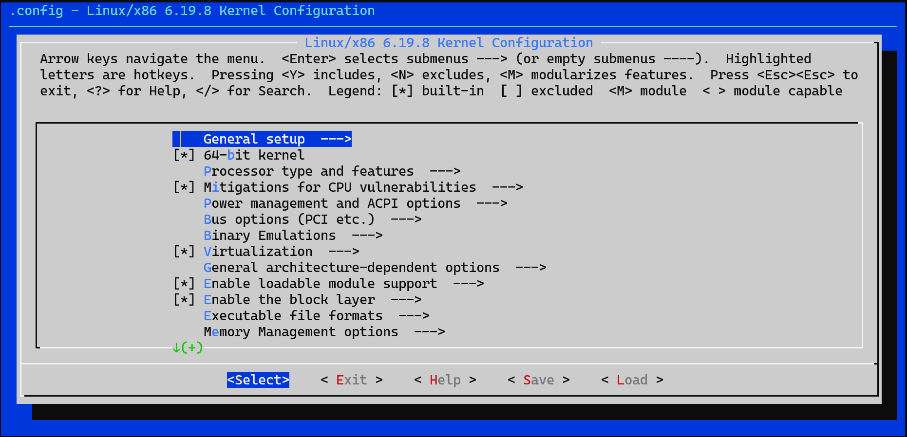

# 우분투(Ubuntu)에서 리눅스 커널을 빌드
우분투(Ubuntu)에서 리눅스 커널을 빌드하는 방법은 크게 필수 패키지 설치, 소스 코드 다운로드, 커널 설정, 컴파일 및 설치의 4단계로 나뉩니다.

1. 필수 패키지 설치
커널 컴파일에 필요한 빌드 도구와 라이브러리를 먼저 설치해야 합니다.
```
sudo apt update
sudo apt install build-essential libncurses-dev bison flex libssl-dev libelf-dev vim bc
```

2. 커널 소스 코드 다운로드
[Linux Kernel Archives](https://www.kernel.org/)에서 원하는 버전의 소스를 받거나, 우분투 저장소의 소스를 이용할 수 있습니다.
```
cd /usr/src
wget https://cdn.kernel.org/pub/linux/kernel/v6.x/linux-6.19.8.tar.xz
```

* 공식 커널 사용 시: wget으로 소스 압축 파일을 받은 후 압축을 해제합니다.
```
tar xfJ linux-6.19.8.tar.xz
```

3. 커널 설정 (.config 생성)
기존 시스템의 설정을 복사해 사용하면 오류를 줄일 수 있습니다.

* 기존 설정 복사: cp /boot/config-$(uname -r) .config
* 설정 변경: make menuconfig 명령어를 실행하여 필요한 모듈이나 옵션을 선택합니다.

```
cd linux-6.19.8
make menuconfig

```

menuconfig 실행결과 화면



필요한 설정을 하고 저장하고 종료합니다 
그럼 현재 폴더에 .config 파일이 생성됩니다 


4. 인증서 관련 설정 제거

.config 파일에서 문제가 되는 인증서 경로를 빈 값으로 수정합니다.

```
scripts/config --disable SYSTEM_TRUSTED_KEYS
scripts/config --disable SYSTEM_REVOCATION_KEYS
```

5. 수동 수정 방법
만약 위 명령어가 작동하지 않는다면, 직접 .config 파일을 열어 수정할 수 있습니다.

   1. nano .config 또는 vi .config 실행
   2. CTRL+W (찾기)를 눌러 CONFIG_SYSTEM_TRUSTED_KEYS 검색
   3. 값을 다음과 같이 비웁니다: CONFIG_SYSTEM_TRUSTED_KEYS=""
   4. CONFIG_SYSTEM_REVOCATION_KEYS도 찾아 값을 비웁니다: CONFIG_SYSTEM_REVOCATION_KEYS=""
   5. 저장 후 종료합니다.

6. 빌드 및 설치
CPU 코어 수를 활용해 병렬 빌드를 진행하면 시간을 단축할 수 있습니다. [10] 

   1. 컴파일: make -j$(nproc) (모든 CPU 코어 사용).
   2. 모듈 설치: sudo make modules_install.
   3. 커널 설치: sudo make install.
   4. 부트로더 업데이트: sudo update-grub 명령어로 새로운 커널을 부팅 메뉴에 등록합니다. 

참고 사항

* 빌드 시간: 시스템 성능에 따라 수십 분에서 수 시간이 소요될 수 있습니다.
* 저장 공간: 빌드 과정에서 대용량의 디스크 공간(최소 40GB 이상 권장)이 필요합니다.
* 버전 관리: 빌드 시 버전 번호를 수정하면 공식 커널과 구분하기 쉽습니다.